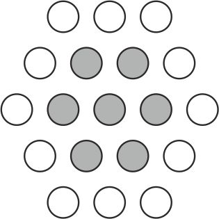

# Game of 21  
Yet another simple logical game

Last weekend I spent some time in my parental home sorting out my old things left from school days, 
and I found some notes of a simple game that I had been playing with my friends for a while. 
By my 30 I have become neither a game developer nor just a developer (although, I hope, this will change),
so let this project be a little step to my dream and a tribute to my childhood.

I plan to code the game model in java so that it could be available for both Windows and Unix platforms.

Here is the initial rules of the game:
1. PLAYERS
1.1. The game is initially for two players.
2. GAME FIELD
2.1. The game field if a hexagonal set of cells with a side of 3 cells.
2.2. Outer cells are white, inner cells are grey.
3. GAME PROCESS
3.1. Players decide who begins the round.
3.2. At each turn the player MUST cross out one or more cells in one of three possible directions.
3.3. When ALL the remaining cells (two or more) belong to a single direction, you CANNOT cross them all: you have to leave AT LEAST ONE cell for your opponent. 
3.4. The round ends when there`s one cell left.
4. WON OR LOST?
4.1. The result of the round depends on the color of the cell left.
4.2. If you`ve made you opponent cross last grey cell, you receive 5 points.
4.3. If you`ve managed to cross last white cell, you receive 3 points.
4.4. In school days the number of rounds were limited by the paper size so play whatever many rounds you want.
5. BONUS: THE NAME OF THE GAME
5.1. To be honest, I don`t remember, why the game has 21 in its name. As you may notice, it has nothing to do with cells number, because there are 19 cells. Another version is that the game ended when one of players reached 21 points. However, this will remain a secret until the end of days.

I highly appreciate you reading this till this point. My contact: korzun.yuri@gmail.com
